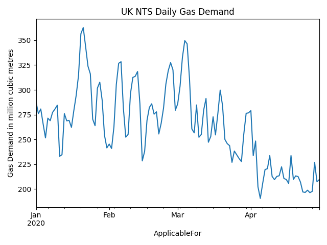

## Introduction
Python package for gathering data from the UK National Grid gas transmission Market Information Provision Initiative (MIPI) API. 

## Installation
1. Clone repository
2. Create python environment using requirements.txt

## Usage

```
import datetime as dt
from matplotlib import pyplot as plt
from mipi import Mipi

M = Mipi()
start = dt.date(2020,1,1)
stop = dt.date(2020,4,30)
df = M.get_physical_flows(start, stop)

df = df.set_index('ApplicableFor')
df['Value'].plot()
plt.ylabel('Gas Demand in million cubic metres')
plt.title('UK NTS Daily Gas Demand')
plt.show()
```


## To Do
- [x] Publish initial version
- [ ] Add lookup of available MIPI data items
- [ ] Create wrappers for common queries (let me know what they are)


